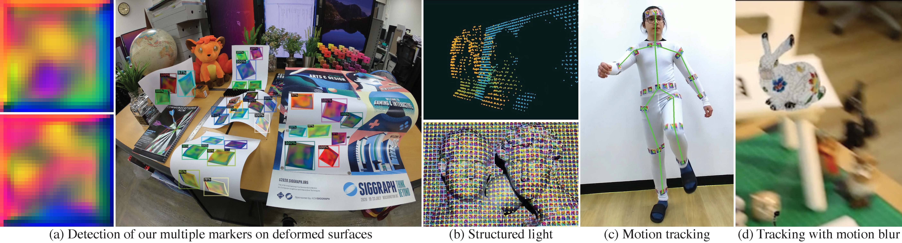
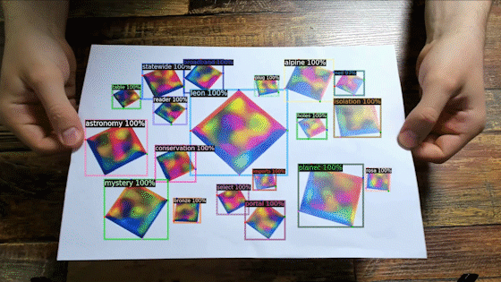

# DeepFormableTag: End-to-end Generation and Recognition of Deformable Fiducial Markers

### [Project page](http://vclab.kaist.ac.kr/siggraph2021/index.html) | [Paper](http://vclab.kaist.ac.kr/siggraph2021/DeepFormableTag-main-screen.pdf) | [Presentation](https://www.youtube.com/watch?v=V6MRbj2SxOY) | [Dataset](https://drive.google.com/drive/folders/1picphIb6Hbj6pM3Wu_Vxu53wzKBV0jdV?usp=sharing)
[Mustafa Berk Yaldiz](https://myaldiz.info),
[Andreas Meuleman](https://ameuleman.github.io), 
[Hyeonjoong Jang](http://vclab.kaist.ac.kr/hjjang/), 
[Hyunho Ha](http://vclab.kaist.ac.kr/hhha/index.html), 
[Min H. Kim](http://vclab.kaist.ac.kr/minhkim/)<br>
KAIST<br>
Visual Computing Lab., School of Computing

In this repository, we provide the code for a fiducial marker system DeepFormableTag, reviewed and presented at **SIGGRAPH 2021**.



If you use DeepFormableTag, please cite our paper with following BibTeX entry.

```BibTeX
@Article{yaldiz2021deepformabletag,
 author = {Mustafa B. Yaldiz and Andreas Meuleman and Hyeonjoong Jang and Hyunho Ha and Min H. Kim},
		title = {DeepFormableTag: End-to-end Generation and Recognition of Deformable Fiducial Markers},
		journal = {ACM Transactions on Graphics (Proc. SIGGRAPH 2021)},
		month = {August},
		year = {2021},
		volume = {40},
		number = {4},
        doi = "10.1145/3450626.3459762",
        url = "https://doi.org/10.1145/3450626.3459762"
}
```

- We cleaned-up and re-implemented the code for the release that includes training, inference, and evaluation codes. 
- DeepformableTag is highly flexible and **does not require specialized camera or printer**.  
- We designed all the components with flexible inference situations in mind, you can quickly modify the code to match certain environmental conditions.

## Installation
There are three ways, *Docker*, *Jupyter notebook* and *Anaconda*, to install our implementation. We recommend using Docker as it is closer to the development environment.

- **Docker**:
	We provide Dockerfiles (docker/*.Dockerfile) for both GPU and CPU builds.
	CPU build is tested on Intel MacBook Pro 2018. NB it is not tested on M1-based Macs at this moment.
	To build them follow:
	```bash
	# GPU Build
	docker build -t deepformable -f docker/Dockerfile .
	```
	```bash 
	# CPU Build
	docker build -t deepformable -f docker/Cpu.Dockerfile . 
	```
	It would be the most preferable option to run on your machine. Note that building the Docker image will take about ten to twenty minutes.
- **Jupyter**: 
	You can also follow the Jupyter notebook [jupyter/deepformable_tutorial.ipynb](jupyter/deepformable_tutorial.ipynb) that automatically installs necessary components in the first cells. It would be good for debugging.
- **Anaconda**:
	If you want to run it on your own local environment, you may want to utilize the following environtment files. We prepared two environment files, `docker/env_cpu.yml` or
	`docker/env_gpu.yml`, to create an anaconda environment for either CPU or GPU, respectively. 
	However, we wouldn't like to recommend this option because resolving the environment and dependencies takes long time.

## Demo
There are two different types of demo in this code. The one with Jupyter notebook provides the complete workflow from the marker generation to the marker detection. The other one allows you to detect and visualize the markers from a given image, video, or webcam stream.
- [Jupyter demo](#jupyter-demo) shows basic functionalities to produce the markers.
This includes generating the markers, predicting the message and location of the markers, and visualizing them.
- [Detection demo](#detection-demo) inputs an image, a video, or a webcam stream, predict markers in the images, and visualizes the predictions on a window or save a video as an output.

Once you build the Docker image from the Dockerfile, first, you may want to run a Docker container to execute the demos:
- Running `xhost +` will provide an access to windows from the codes. We need this to make the codes create windows from the Docker container. However, beware that this disables the access control and allows clients to control from any host. 
- Next, you can run the container to execute the demos. Run the following commands in the directory of the repository.
	- For `GPU build`:
		```bash
		docker run --rm -it --runtime=nvidia --privileged --ipc=host -v $PWD:/host \
			-e DISPLAY --network=host -v /tmp/.X11-unix:/tmp/.X11-unix deepformable \
			/bin/sh -c 'cd /host; python -m pip install -e .; bash' 
		``` 
		- `--runtime=nvidia` enables the CUDA in a container.
	- For `CPU build` (Linux only):
		```bash
		docker run --rm -it --privileged --ipc=host -v $PWD:/host \
			-e DISPLAY --network=host -v /tmp/.X11-unix:/tmp/.X11-unix deepformable \
			/bin/sh -c 'cd /host; python -m pip install -e .; bash' 
		```
		- To run the Docker container on a Mac with a display support, we need an extra step, following the instructions at [tools/README.md](tools/README.md#running-a-docker-container-with-x11-window-support-on-mac).
	- `-v $PWD:/host` *mounts the current directory to the container.* It means any changes you make in the repository folder will be reflected to the container, and any changes done at `/host` folder will be reflected to the repository folder at the host.
	- `--privileged --ipc=host` enables peripheral devices like webcam and extended access.
	- `-e DISPLAY -v /tmp/.X11-unix:/tmp/.X11-unix` connects display to the container.
	- `--network=host` uses host's network connection, this way you can access Jupyter ports without forwarding them.
	- `--rm` removes the container after the exit, and `-it` is for interactive container access.

### Jupyter Demo

To run the marker generation, detection and visualization through the Jupyter notebook, 
please follow the tutorial file [jupyter/deepformable_tutorial.ipynb](jupyter/deepformable_tutorial.ipynb). 
```bash
cd /host && jupyter notebook --allow-root
```

You can also run this on [Google Colab](https://colab.research.google.com/github/KAIST-VCLAB/DeepFormableTag/blob/master/jupyter/deepformable_tutorial.ipynb) in the Google Drive that we additionally provide.

### Detection Demo

To run the detector using your own video, you may want to print an [example board we generated](files/example_boards/random_board1.pdf) first.

To generate your own markers with custom configuration, please read [the README file](tools/README.md) in the `tools` folder for a detailed information.

Download [model weights](https://drive.google.com/file/d/1TE7fDoM2MRSKPu3MT7eAPE7yGo5BUrmW/view?usp=sharing) into `models` folder in repository. 
To do this, you can use *gdown* (you need to install it first by calling `pip install gdown`) as following:
```bash
cd /host && mkdir models
gdown https://drive.google.com/uc?id=1TE7fDoM2MRSKPu3MT7eAPE7yGo5BUrmW
```
Model weights include weights for the marker generation and detection networks. 
You can provide binary messages in the form of the JSON file like [template_config.json](files/template_config.json)
to generate those messages and detect them.



Running the detector will generate visualizations of the detected markers like above. Here is the command to run it:
```bash
python tools/predictor_demo.py --video-input /host/files/example_video.mov \
	--output output/test_out.mov --parallel \
	--config-file configs/deepformable-main.yaml \
	--marker-config-file files/template_config.json \
	--opts MODEL.WEIGHTS /host/models/deepformable_model.pth
```
- When running the predictor_demo, you can use your webcam, a video, or a folder of images.
	- `--webcam` will get inputs from the webcam stream.
	- `--video-input /host/files/example_video.mov` will use the video input for the predictor_demo.
	- `--input` will use the specified folder of images as an input.
- `--output /host/output/test_out.mp4 ` if you remove this option, the output will be drawn to a window.
- `--config-file configs/deepformable-main.yaml ` config file for model's architecture
- `--marker-config-file files/template_config.json` this file provides binary messages and class names of the markers.
- `--parallel` add this in the beginning as an argument if you want to use multiple GPUs for marker detection.

### Evaluation on Test Data

We provide [real-world test datasets](https://drive.google.com/file/d/1vvUqkoL082lQKkaxz792wIrG-qUBh87G/view?usp=sharing) (`flat` / `deformation` / `deformation/deformation_2cm` / `deformation/deformation_6cm` / `deformation/deformation_10cm`) to evaluate our model:
Here is the command to run the evaluation script:
```bash
python tools/train.py --eval-only --dataset-test-dir /host/output/test-realworld/flat \
	--config-file configs/deepformable-main.yaml \
	--marker-config-file /host/output/test-realworld/marker_config.json \
	MODEL.WEIGHTS /host/models/deepformable_model.pth
```

### Training

We provide training code which you can run through below command:
```
python tools/train.py --num-gpus 8 --config-file configs/deepformable-main.yaml
```
We use 8 GPU servers to train our model. For the case of not enough resources, learning rate and batch size can be adjusted for stable training. 

You can use below line to run docker container for training in headless server environment:
```
docker run --rm -it --runtime=nvidia --ipc=host --network=host -v $PWD:/host \
	-v /home/myaldiz/Data/Deepformable:/Data deepformable \
	/bin/sh -c 'cd /host; python -m pip install -e .; bash'
```
We place our data to `/Data/Datasets/` folder, which we mount through `-v` option. For preparing dataset please refer below.

## Further Details

**Please read** [tools/README.md](tools/README.md) to get further details on dataset and preprocessing.
## License

Mustafa B. Yaldiz, Andreas Meuleman, and Min H. Kim have developed this software and related documentation (the "Software"); confidential use in source form of the Software, without modification, is permitted provided that the following conditions are met:

Neither the name of the copyright holder nor the names of any contributors may be used to endorse or promote products derived from the Software without specific prior written permission.

The use of the software is for Non-Commercial Purposes only. As used in this Agreement, “Non-Commercial Purpose” means for the purpose of education or research in a non-commercial organization only. “Non-Commercial Purpose” excludes, without limitation, any use of the Software for, as part of, or in any way in connection with a product (including software) or service which is sold, offered for sale, licensed, leased, published, loaned or rented. If you require a license for a use excluded by this agreement, please email [minhkim@kaist.ac.kr]([mailto:minhkim@kaist.ac.kr]).

Warranty: KAIST-VCLAB MAKES NO REPRESENTATIONS OR WARRANTIES ABOUT THE SUITABILITY OF THE SOFTWARE, EITHER EXPRESS OR IMPLIED, INCLUDING BUT NOT LIMITED TO THE IMPLIED WARRANTIES OF MERCHANTABILITY, FITNESS FOR A PARTICULAR PURPOSE, OR NON-INFRINGEMENT. KAIST-VCLAB SHALL NOT BE LIABLE FOR ANY DAMAGES SUFFERED BY LICENSEE AS A RESULT OF USING, MODIFYING OR DISTRIBUTING THIS SOFTWARE OR ITS DERIVATIVES.

Please refer to [license](LICENSE) for more details.

## Acknowledgement

This project uses the following open-source libraries and repositories, 
please consider citing them if you use related functionalities:
- [OpenCV](https://github.com/opencv/opencv)
- [Detectron2](https://github.com/facebookresearch/detectron2)
- [Inpainting Deepfill](https://github.com/JiahuiYu/generative_inpainting)
- [VoVNet](https://github.com/youngwanLEE/vovnet-detectron2)
